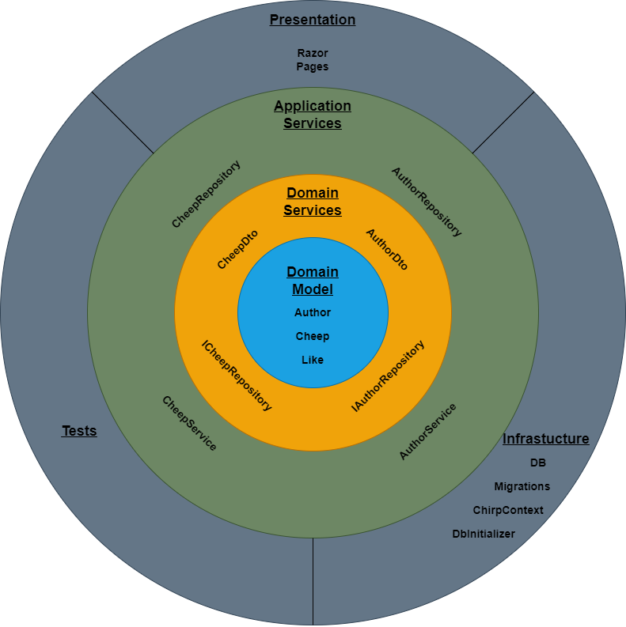
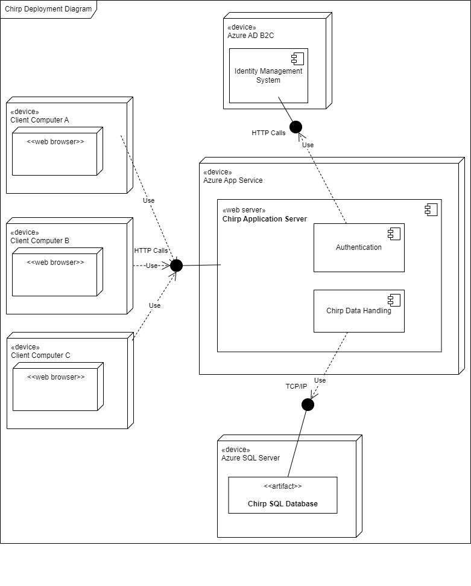
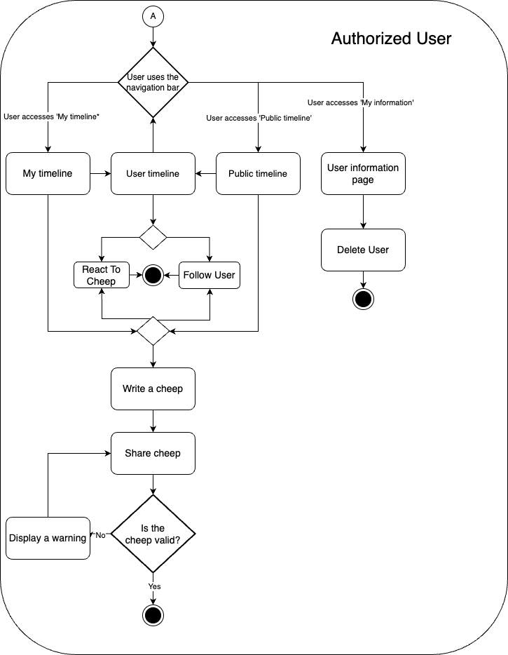
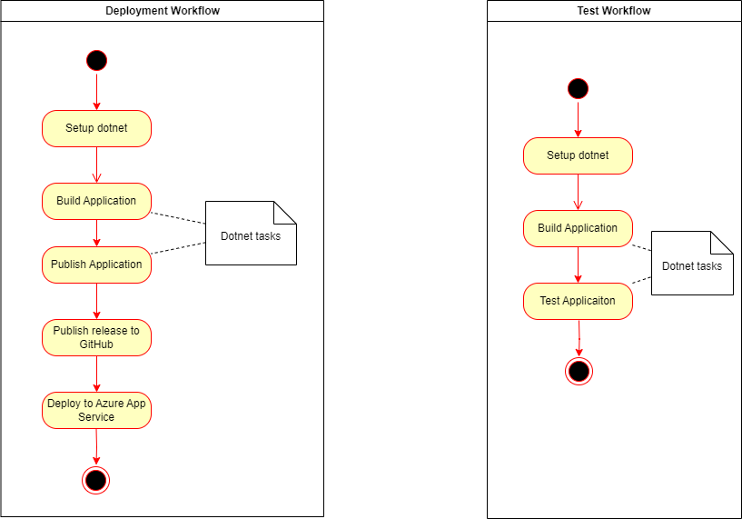
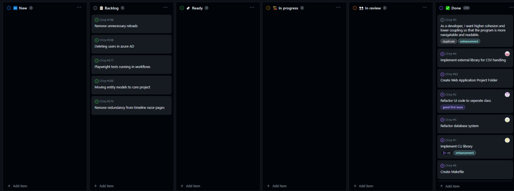

# Design and Architecture of _Chirp!_

## Domain model

Here comes a description of our domain model.

{width=100%}

## Architecture — In the small

The diagram shows that

- **Domain Model** consists of the existing entities. 
- **Domain Services** consists of DTO's and repository interfaces.
- **Application Services** consists of services available for the users and repositories.
- **Presentation consists** of views and controllers.
- **Tests** consists of xunit, integration and end2end tests.
- **Infrastructure** consists of EF Migrations, DbContext and model design.

{width=100%}

## Architecture of deployed application
The following diagram shows the four parts of our deployed application.

- **Client**: A browser on the users machine. Sends HTTP calls to the server.
- **Server**: RazorPages project hosted at https://bdsagroup21chirprazor.azurewebsites.net/. Receives client request, and responds with HTML pages for the client to render. Communicates with database to fetch or update data. Communicates with Identity Management System to validate client authentication.
- **Database**. MSSQL database hosted in Azure. Hosted at bdsagroup21-chirpdb.database.windows.net
- **Azure** AD B2C identity management hosted in Azure. Hosted at getchirping.onmicrosoft.com
{width=100%}

## User activities
{width=100%}

{width=100%}

## Sequence of functionality/calls through _Chirp!_
The following subsystem sequence diagram shows the communication between three subsystems.

- Client: A browser on the users machine. Sends HTTP calls to the server.
- Server: the webserver available at https://bdsagroup21chirprazor.azurewebsites.net/.
- Databse: MSSQL database hosted in Azure.
**Note That**
- When the website is requested with endpoint: "/". The Razor page Public.cshtml is to be returned. Since the Public razor pages controller inherit the Timeline controller, The OnGet() method from the Timeline controller is invoked. The prementioned method tries to fetch cheeps and followings.
- Arrow 1.6 determines whether the user is authorized and hence, if the server should request the users followings.

{width=100%}

# Process

## Build, test, release, and deployment
We use two GitHub Actions workflows, one for testing, and one for release / deployment. The **test workflow** is triggered on any push to the main branch, and has to complete successfully before any pull request to main can be completed. Together with our branch policy that forbids pushing directly to main, this means that any code that reaches main has passed the tests.

The **deployment workflow** is triggered by pushing a tag to the main branch, that matches the regex `v*.*.*`. This workflow builds the application, publishes it to GitHub, and deploys it to Azure. Database schema synchronization is not included here, as it is performed during startup of the application, when it runs a new version.

{width=100%}

## Team work

{width=120%}

### Unresolved tasks
- [217](https://github.com/ITU-BDSA23-GROUP21/Chirp/issues/217): We were not able to get our e2e UI tests running in our GitHub Actions workflow yet. This should be fixed, so they will be integrated into our automatic testing, and we can be certain that all code in the main branch has passed the tests.
- [208](https://github.com/ITU-BDSA23-GROUP21/Chirp/issues/208): When anonymizing a user after they click "Forget about me", we do not delete the user entry in our Azure AD B2C. Ideally the user should also be deleted there, but it was not considered a high priority to implement at this point.
- [196](https://github.com/ITU-BDSA23-GROUP21/Chirp/issues/196): Every time the user interacts with the page, the page is reloaded. I.e. when a user follows another user, or likes a cheep, the page is reloaded, and they lose their position on the page. This is not a great user experience, but as the system is still usable, it was considered a higher priority to fully implement the other features.

### Task Workflow

When a new task need to be done we create an issue on GitHub. In the issue title we shortly describe the task and explain in further depth in the description as well as state the requirements for when the task is complete. After creating the issue, it is then added to the project board under the label 'new'. When some developers have time they assign themselves to the issue, create a branch and start working on resolving the issue. A pull request is then made when the issue has been resolved and GitHub runs the GitHub actions we have set up. This includes building and testing the application, ensuring the code does not contain sensitive information with CodeQL and linking the related issue to the pull request. After these GitHub Actions have completed successfully, it needs to be reviewed and approved by some of the developers that have not worked on it. When approved the branch will be merged into the main branch, the related issue will be closed and the status of the issue will be set to done on the project board.  
The flow of these events are visualized in the diagram below. 

{width=100%}

## How to make _Chirp!_ work locally
Prerequisites:
- Dotnet
- Git
- Docker Desktop

1. Clone our Chirp project from the main branch on its GitHub page at https://github.com/ITU-BDSA23-GROUP21/Chirp.  
2. If you do not have Docker Desktop installed then follow the steps on their [website](https://www.docker.com/products/docker-desktop/) to download and install Docker Desktop.  
3. Open the terminal and pull the Docker Image of Microsoft SQL Server with the command
    - Due to hardware issues on some Mac computers, you must create a Postgres database instead if you are running OSX.
`docker pull mcr.microsoft.com/mssql/server:2022-latest`.
4. Start up a container based on the image pulled from before with the command  
`docker run -e "ACCEPT_EULA=Y" -e "MSSQL_SA_PASSWORD=YourPassword123" -p 1433:1433 --name sql1 --hostname sql1 -d mcr.microsoft.com/mssql/server:2022-latest`.
    - If you are using Mac and running OSX then start a docker with the Postgres image instead.
5. In the terminal navigate to the where you have cloned the project to and navigate to the folder `Chirp/src/Chirp.Razor`.  
6. Initiate user secrets for the project with `dotnet user-secrets init`.  
7. Store the connection string to the database container in a user secret called `ConnectionString` with this command:  
`dotnet user-secrets set "ConnectionString" "Server=localhost;Database=TestDB;User Id=SA;Password=YourPassword123;TrustServerCertificate=True;"`.  
8. Now run the application with the command `dotnet run`

## How to run test suite locally

Our test suite consists of several unit tests, integration tests and a couple end to end UI tests. Most of our unit and integration tests are testing the methods in the Repository classes in the package `Chirp.Infrastructure`, as that is where most of the application's logic resides. We also have a couple of old tests that test the methods in the service classes in the package `Chirp.Razor`. However since the methods in the service classes just call the methods from the repository classes, we have decided it would be redundant to write more tests the service classes.  
Lastly, we also have end to end UI tests that uses playwright to test different scenarios from the end users point of view. To simulate an end user, we have created a dummy Gmail and a dummy GitHub account.  
Gmail: dummyaccountfortesting000@gmail.com  
Gmail Password: dummyemailfortesting  
GitHub Password: dummygithubaccountfortesting  
To run our tests follow the steps below.  

1. To run the test suite locally, make sure to have installed docker.  
2. Open the terminal and navigate to the project folder.  
3. In the project folder run the command `dotnet test --filter FullyQualifiedName!~Chirp.Razor_test.End2EndUI` to run the integrations tests. Make sure docker is running before running the command.
    - To use the exclamation mark (`!`) in the filter expression, you may have to escape it with a backslash (`\`) if you are using Linux or macOS shells.  
4. After the integrations tests are done navigate to the folder `Chirp/src/Chirp.Razor/`.  
5. Run the application with the command `UITEST=1 dotnet run`.  
6. Open another terminal and navigate to the root project folder.  
7. To run the UI test run the command `dotnet test --filter FullyQualifiedName~Chirp.Razor_test.End2EndUI`. If you want to see what the test does run the following command instead `PWDEBUG=1 dotnet test --filter FullyQualifiedName~Chirp.Razor_test.End2EndUI`.
    - Since we have made a dummy Gmail and GitHub account, sometimes when logging in to GitHub it will prompt to enter a confirmation code that was sent via mail. This will fail the tests. A workaround is to run the test in debug mode with the second command and manually go through the first steps to log in to GitHub. 

# Ethics

## License
This application uses the MIT license. For the full license agreement, see https://github.com/ITU-BDSA23-GROUP21/Chirp/blob/main/LICENSE. We have confirmed that this license is in line with the packages used in the program.

<!-- Should we write some considerations of how the packages we use impacts our choice of license?
     And have we confirmed that MIT license is OK with all the packages we added later on? -->
## LLMs, ChatGPT, CoPilot, and others
No LLMs were used in the development of this application. 